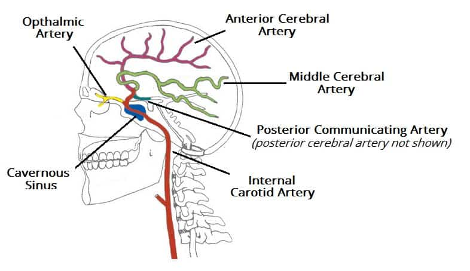
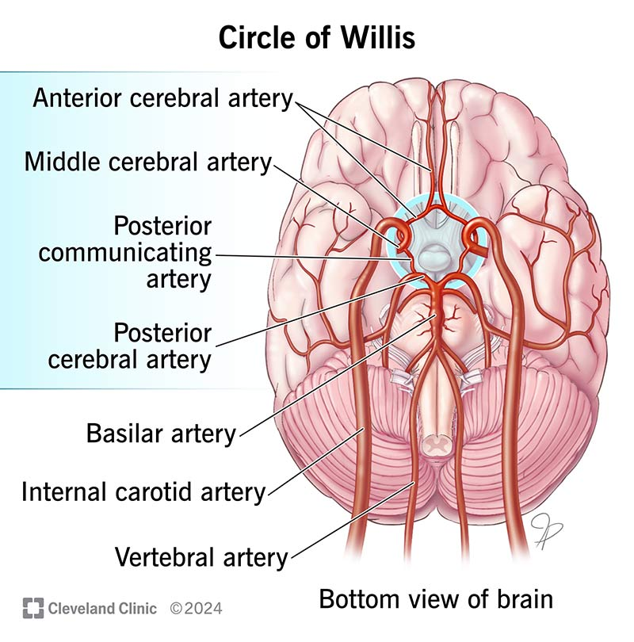

# Stroke

_Health › Circulatory system diseases_

[Course link](https://www.khanacademy.org/science/health-and-medicine/circulatory-system-diseases)

## Summary

- A stroke is an interruption of the blood flow within the brain, leading to the death of brain cells.
  - Can be caused by a blocked blood vessel (ischemic stroke) or a leaked/burst blood vessel (hemorrhagic stroke) 

## Anatomy and Physiology

- Blood carried to the brain via two pairs of major arteries: Carotid and Vertebral

- Brain is organized into 3 parts:
  - Brain Stem: Connects the brain to the top of the spine; controls involuntary processes like heart rate, blood pressure, breathing, consciousness, sleeping, and eating
  - Cerebellum: Attached to the back of the brain stem. Controls coordination and balance and fine-tuned muscle movements and motor function
  - Cerebrum: The largest part of the brain, organized into two hemispheres, which are further divided into four lobes (frontal, parietal, temporal, occipital)
    - Frontal lobe: Controls movement and executive functioning, memory formation
    - Parietal Lobe: Processes senses and handles hand-eye coordination
    - Temporal Lobe: Controls hearing, memory, recognition of faces and language, long-term memories
    - Occipital Lobe: Processes signals from the eyes
- Blood-Brain Barrier (BBB):  separates central nervous system tissue from anything harmful in the blood
  - Endothelial cells
  - Basal lamina: thick, underlay of the endothelial cells
  - Tight Junctions: Just allow red blood cells and such through - seal up space between the endothelial cells
  - Astrocyte endfeet - help maintain the blood-brain barrier

   
## Types of Strokes

- Ischemic: Strokes caused by a blockage; about 8/10 strokes
- Hemorrhagic: Strokes caused by a brain bleed. Less common than ischemic strokes, but more deadly
  - Uncontrolled bleeding can flood an area of the brain, resulting in pressure and swelling as well as oxygen/nutrient deprivation
  - Typically caused by high blood pressure or defects in the arteries
    - Common artery defects leading to strokes are aneurysms (weak areas n the blood vessel that bulge and can burst) - called "berry aneurysms"
  - Can result in secondary strokes due to vasospasms (irritated arteries)
  - Can also be caused by AVMs (Arteriovenous Malformaton)
  - 2 Zones:
    - Ischemic Core - the area that's been blocked off
    - Ischemic Penumbra: ischemic but still viable - tends to surround the ischemic core; kept alive by collateral arteries, but blood flow must be restored within hours to keep them alive
      - This is the area where treatments are most likely to be effective
- Areas of Damage and Effects:
  - Brain Stem - Uncommon but often fatal; issues w/ breathing, heart function, balance and coordination, weakness, paralysis
  - Cerebellum: Less common than in the cerebrum; issues w/ balance and coordination, dizziness, headaches, nausea, and vomiting
  - Cerebrum (Left) - Weakness or paralysis in the right side of the body, cognitive problems w/ reading, talking, thinking, learning/memory
  - Cerebrum (right) - Problems w/ vision, depth perception, short-term memory loss and judgement, weakness/paralysis on left side
- Watershed area in the center of each hemisphere, where brain is prone to being damaged due to lack of blood flow (hypo-perfusion) - since blood gets to the brain from the inside out and the outside in, the area in between them is at risk of less flow.

![image}(watershed.jpg)

## Signs of a stroke

Malfunction tends to manifest after about 3 minutes, due to lack of oxygen and glucose

- Face drooping unnaturally on one side
- Difficulties raising the arm on one side
- Feeling of confusion, trouble understanding what others are saying
- Speech may sound slurred and jumbled
- Difficulty seeing through one or both eyes

## Risk Factors

- Uncontrollable
  - Male
  - Family history
  - Old age
- Modifiable
  - High blood pressure (responsible for over 50% of strokes)
  - Atrial Fibrillation (irregular heartbeat)
    - Blood stays "still" longer in the heart, which leads to clotting
      - Similar for myocardial infarction (heart attacks)  
  - High Cholesterol
  - Diabetes
  - Physical Inactivity
  - Smoking
- Responsible for almost 10% of deaths worldwide; #2 killer after heart disease
- Almost 17 million people worldwide have a stroke each year

## Testing and Treatment

- Ischemic Stroke:
  - Confirmed via a CT scan
  - Treated first with clot-busting drugs (tissue plasminogen activator) to restore blood flow and reduce damage
- Hemorrhagic Stroke:
  - Doctor will find source of bleed to control it; may require immediate surgery to reduce pressure and damage
- Tests often include:
  - Physical examination
  - CT (computerized tomography) scan to identify the type of stroke
  - MRI (magnetic resonance imagery) to visualize brain tissue damage
  - Echocardiogram to show the heart's valve function
  - Angiography to examine blood flow through the brain
  - Blood and urine tests
  - Electrocardiogram (ECG) to check the electrical activity of the heart
  - neurological exam: check how brain function has been affected by the stroke

## Ischemic Strokes

- 3 Subtypes:
    - Thrombotic: Occurs when the clot forms in one of the major arteries
    - Typically occurs in the middle cerebral artery (either side), internal carotid arteries, and basilar artery
    - Lacunar strokes: Occur in the smaller vessels; due to thickening over time from hypertension; less blood gets through them, resulting in even more thickening
    - Embolic: Occurs when the clot forms elsewhere and travels to lodge in the brain
      - Usually linked to atherosclerosis (buildup of plaque on inside arterial walls) - clots occur when plaque ruptures
      - Embolism: A traveling blood clot
- Note: TIA: Transient Ischemic Attack: Mini-Stroke
  - Temporary (<24 hours)
  - Similar symptoms to a stroke
  - Doesn't cause brain cell death
- The Ischemic Cascade
  - No blood supply -> No Oxygen -> No ATP
    - Plan B: Anaerobic metabolism
      - ~15x less energy (ATP)
      - Produces lactic acid, which disrupts the normal acid-base balance in brain, and can damage neurons
    - Without ATP, sodium-potassium pump not working, and sodium builds up in the neuron.
      - Water in the intercellular fluid rushes into the neuron to dilute the high sodium concentration; neuron swells: **cytotoxic edema** - one of the earliest things that happens
    - Without ATP, sodium-calcium pump also stops working - increasing amount of calcium in cell
      - Excitotoxicity - neurotransmitter release due to high calcium - excites other neurons, which releases neurons elsewhere, vicious cycle
      - Activates degradative enzymes - breaks down proteins in neuron and breaks down the cell membrane of the neurons (releasing more harmful ions)
      - Generates free radicals and reactive oxygen specied generation
    - Mitochondria break down, releasing apoptotic factors into the cytoplasm, causing cells to destroy themselves
    - Blood brain barrier starts to break down due to inflammatory reaction, ~4-6 hours after stroke
      - Endothelial cells get leakier, and basal lamina loses ability to restrict flow
      - Proteins and water leak out at will; extracellular space becomes flooded with vasogenic edema
      - Results in mass effect - swelling of brain tissue
      - Brain herniation - brain swelling is so bad that parts of brain are pushed out of position; often fatal. Worsens over a few days, peaking at 3-5 days post stroke
  - Swelling from initial ischemia
    - While neurons die, they release DAMPS (damage associated molecular patterns) - alert other cells that something bad is going on, trigger inflammatory response, release macrophages and activate immune response
    - Inflammatory cells become anti-inflammatory cells, act as the "cleanup crew"
  - Liquefactive necrosis
    - In a small necrotic area, it is walled off and removed by macrophages; does not regenerate
    - In a larger area, it is walled off and becomes a cyst; gets cleaned up by immune system cells and becomes a large cavity (a hole in the brain)

- 

## Resources

- 
