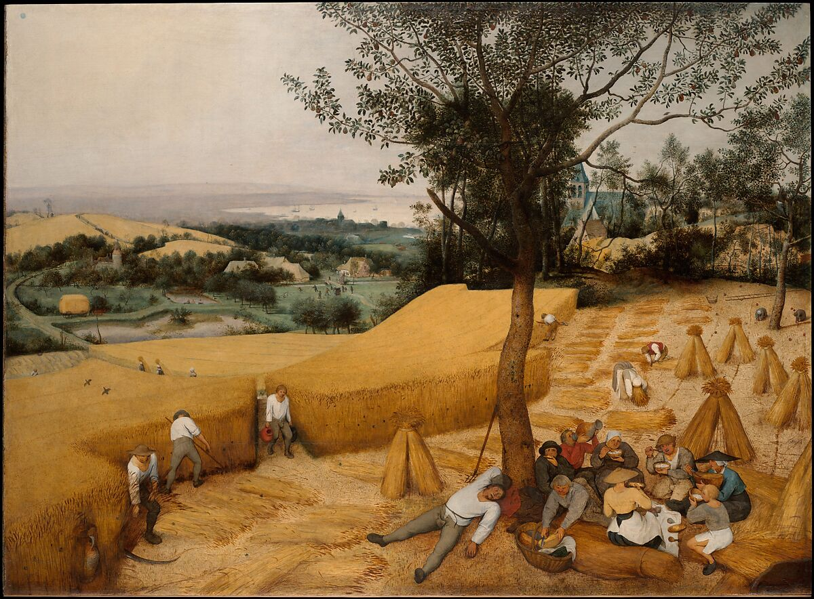

# The Harvesters Exercise - Picturing Change

Source: [Khan Academy](https://www.khanacademy.org/humanities/world-history/x66f79d8a:the-long-nineteenth-century/x66f79d8a:the-industrial-revolution-7-5/a/activity-opener-picturing-change)

# Exercise:
  
## Purpose
  In this activity, you will analyze a pre-industrial European farming scene to understand how communities worked and produced goods before the Industrial Revolution, and predict how these systems would change with industrialization.

## Process

Examine this painting, looking especially for evidence about this society’s community and methods of production and distribution.

# Questions

1. What does this painting suggest about this society's community - how people live and interact with one another?

   This painting suggests much work was shared, and that days were routine and well-organized, with a time to work and a time to rest. People are involved in different tasks (it appears the women are gathering, the men are harvesting, and others are in charge of carrying, serving food, etc).   

2. What does this painting suggest about the society's production and distribution - how goods or resources are created and shared?

   No one person was solely responsible for the product - it took a lot of people, all doing different things. Similarly, it seems there is one source of bread and water for everyone, suggesting resources are shared, as well as created, together.

Reflect: Predict how this society’s community and methods of production and distribution might change with the rise of the Industrial Revolution.

  Under the Industrial Revolution, it might be easier for one person to "claim ownership" of the process. Like how land was owned and "rented" under the vassal system, through factories, one person might have greater control over the process, and therefore the product.

  
